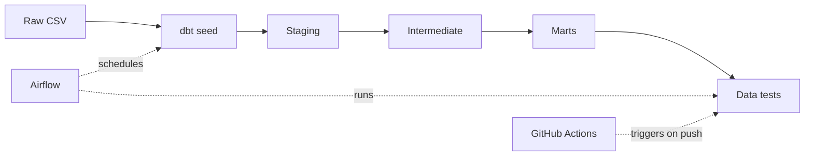

# Telco Customer Churn – Modern Data Pipeline

This is a personal project that simulates a real-world analytics engineering pipeline.  
It takes raw customer data from the [Kaggle Telco Customer Churn](https://www.kaggle.com/datasets/blastchar/telco-customer-churn) dataset and transforms it into tested, documented, analysis-ready tables using a modern data stack.

I decided to build it as part of my transition from bioinformatics into data engineering, or more specifically, from academics to tech industry stack. This repository reflects some of the practices and tools I aim to work with daily: automated quality checks, reproducible environments, CI/CD, and orchestration.

## What it does

- Ingests the raw CSV and loads it as a seed in dbt
- Cleans, normalizes and enriches the data through three standard layers: staging → intermediate → marts
- Applies 10 custom and generic tests to guarantee data quality
- Orchestrates the pipeline daily with Apache Airflow
- Runs automated CI on every push using GitHub Actions

It is also containerized in docker to ensure full reproducibility.

---

## Architecture



For this project, I have used the standard dbt modeling layers:

* **Staging** — Rename, cast, clean. 1:1 with source.
* **Intermediate** — Basic business logic, churn flagging, customer segmentation.
* **Marts** — Aggregated tables ready for analysis or dashboards.

## Tech stack

| **Role**           | **Tool**                                    |
|:------------------:|:-------------------------------------------:|
| Transformation     | dbt-core 1.11 + dbt-duckdb                  |
| Database           | DuckDB                                      |
| Orchestration      | Apache Airflow 2.9                          |
| CI/CD              | GitHub Actions                              |
| Environment        | GitHub Codespaces / local                   |
| Additional testing | pre-installed dbt-utils                     |

## Quick Start

All services are managed with Docker Compose. You only need **Docker** and **Git**.

1. **Clone the repo**  
   ```bash
   git clone https://github.com/Javiersdr/Churn-pipeline.git
   cd Churn-pipeline
   ```

2. **Build and start the services**
   ```bash
   docker-compose build
   docker-compose up -d
   ```

3. **Access Airflow**

Open your browser and go to http://localhost:8080. Log in with ```admin```/```admin```. Then, enable the __churn_pipeline__ DAG and trigger a manual run.

## Development without Airflow

If you only want to work on dbt models interactively:
```bash
docker-compose run --rm dbt
dbt seed && dbt run && dbt test
```
All tests should pass, except a warning (see below).

## Pipeline and tests explanation

### Inside the pipeline

- **Staging (`stg_telco__customers`)** – renames columns, fixes data types, normalizes values.
- **Intermediate (`int_churn_features`)** – join data, create relevant flags and creates `TotalCharges` column from `MonthlyCharges * tenure`.
- **Marts (`fct_churn_analysis`)** – final table, ready for dashboards or machine learning.

### Data quality

The project includes **10 data tests**:

- 8 generic tests (not_null, unique, accepted_values, accepted_range)
- 2 custom tests:
  - `check_phone_logic` – ensures phone‑related columns are consistent.
  - `check_charges` – checks that `TotalCharges ≈ MonthlyCharges * tenure`.  
    *Because some customers may have `TotalCharges IS NULL` (new customers), this test is configured to **warn** instead of failing.*

## CI/CD with GitHub Actions

A basic [GitHub Actions workflow](.github/workflows/dbt_ci.yml) runs **dbt run** and **dbt test** on every push to `main` 
in order to make sure the pipeline never breaks without me knowing.


## Future improvements

### Raw data availability

Replace the CSV seed with a live database connection.

### Data science

- Add a **predictive churn model** (ML) and serve it as a Streamlit dashboard.
- Evolve the pipeline towards **MLOps** (model tracking, deployment).

### Cloud data warehouse

Migration from DuckDB to Snowflake/BigQuery to allow scalability.

### Advanced tests

For complex data validation requirements and enhanced data quality. Maybe even dbt expectations.