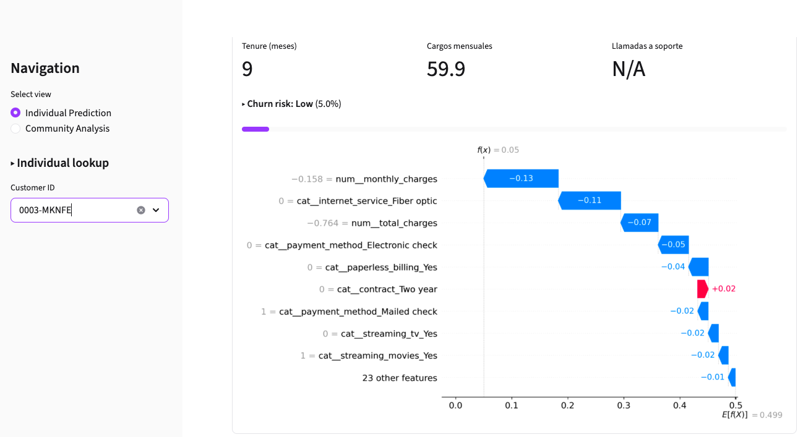
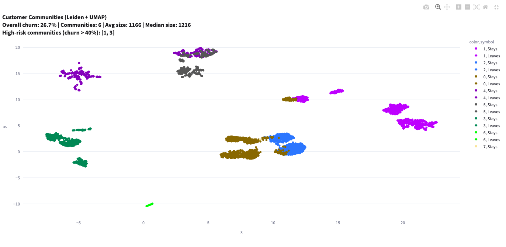
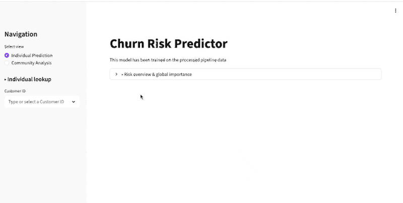
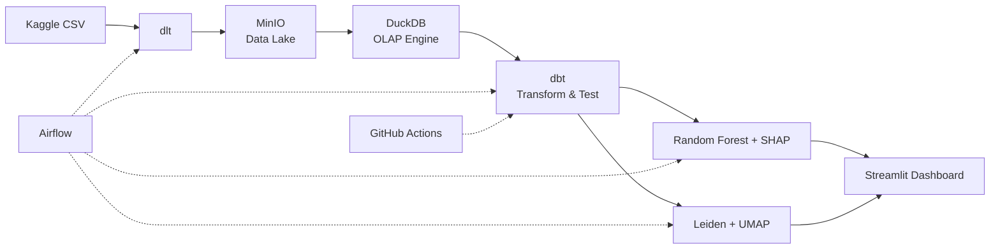

# Telco Customer Churn: An ML and Ecological analysis – Complete Data Pipeline

[](https://github.com/Javiersdr/Churn-pipeline/actions/workflows/dbt_ci.yml)

A full‑stack data project that transforms raw customer data into **actionable business insights** using a modern, cloud‑native stack. It covers the complete lifecycle: **ingestion, data warehouse, machine learning, interactive dashboard**, as well as CI/CD integration.

Built as part of my transition from bioinformatics to Data Engineering & Science, this repository demonstrates the practices I can bring to any data team: **reproducibility, testing, orchestration, and explainability**.

---

## Preview

| **Individual Prediction** | **Community Network** |
|---|---|
| |  |




## Architecture



* **dlt** ingests the raw CSV into MinIO (an S3‑compatible Data Lake).
* **DuckDB** queries the Data Lake directly via httpfs.
* **dbt** transforms, tests, and documents the data through staging → intermediate → marts standard layers.
* A **Random Forest** classifier predicts individual churn risk and explains it with **SHAP**.
* **Leiden community detection** reveals groups of customers with shared churn risk (co‑abandonment).
* A **Streamlit dashboard** presents both individual predictions and community insights.

## Tech stack

| **Role**                 | **Tool**                                    |
|:------------------------:|:-------------------------------------------:|
| Ingestion                | dlt (data load tool)                        |
| Data Lake                | MinIO (S3‑compatible)                       |
| Query Engine             | DuckDB                                      |
| Transformation & Testing | 	dbt‑core + dbt‑duckdb + dbt‑utils          |
| Orchestration            | Apache Airflow                              |
| Supervised ML            | scikit‑learn (Random Forest), SHAP          |
| Unsupervised ML          | leidenalg, igraph, UMAP, Plotly             |
| Dashboard                | Streamlit                                   |
| CI/CD                    | GitHub Actions                              |
| Reproducibility          | Docker, Docker Compose, Makefile            |

## Quick Start

### Prerequisites

- Docker & Docker Compose

- Git

### Step by step

1. **Clone and configure**

```bash
git clone https://github.com/Javiersdr/Churn-pipeline.git
cd Churn-pipeline

# Set up env variables
cp .env.example .env

# Set up dlt credentials (local MinIO defaults)
cp -r .dlt.example .dlt

# Set up dbt profile (local MinIO defaults)
cp dbt_churn/profiles.example.yml dbt_churn/profiles.yml
```

2. **Run the pipeline**

```bash
make pipeline
```
This single command will start all required services (MinIO, Airflow, Postgres, Dashboard) and then execute the full pipeline: ingestion, dbt transformations and tests, Random Forest model, network analysis.

3. **Explore the results**

| **Service**   | **URL**               | **Credentials**  |
|:-------------:|:---------------------:|:----------------:|
| Dashboard     | http://localhost:8501 | -                |
| Airflow       | http://localhost:8080 | admin / admin    |
| MinIO console | http://localhost:9001 | admin / password |


## Pipeline and tests explanation

### Ingestion

The raw CSV is ingested with **dlt**, which:

* Infers the schema automatically

* Normalises column names to snake_case

* Writes data as compressed JSONL files to MinIO `(s3://churn-data-lake/telco/)`

* Provides atomic writes, incremental loading, and lineage metadata

- **Staging (`stg_telco__customers`)** – Reads directly from MinIO, casts types, normalises values.
- **Intermediate (`int_churn_features`)** – Business logic: churn flag, customer tenure segment, feature engineering and creates `TotalCharges` column from `MonthlyCharges * tenure`.
- **Marts (`fct_churn_analysis`)** – final table, ready for dashboards or machine learning.

### Data quality

The project includes **10 data tests**:

- 8 generic tests (not_null, unique, accepted_values, accepted_range)
- 2 custom tests:
  - `check_phone_logic` – ensures phone‑related columns are consistent.
  - `check_charges` – checks that `TotalCharges ≈ MonthlyCharges * tenure`.  
    *Because some customers may have `TotalCharges IS NULL` (new customers), this test is configured to **warn** instead of failing.*

## Machine Learning

### Supervised: Individual Churn Prediction

* **Random Forest** with class balancing.
* **SHAP** waterfall plots to explain each prediction.
* Model and explainer exported for the dashboard.

### Unsupervised: Co-abandonment Network

* Customer similarity matrix into graph into **Leiden community detection**.
* 6 communities discovered, two of them with a churn rate higher than 40%.
* **Community Health Index** inspired by ecological resilience theory.
* Direct comparison of highest vs lowest churn-risk communities.

## Streamlit Dashboard

Two interactive views:

* **Individual prediction** -> Select a customer to calculate its churn probability + Shap waterfall plot.
* **Community Analysis** -> Community summary, churn rates, CHI, interactive UMAP network, business insights.

### Key finding

The most resilient community consists almost entirely of customers without internet service, more specifically, basic phone plan users with long tenure and low bills. Their stability comes from simplicity. The most vulnerable community has internet (Fiber/DSL) but rejects add-on services, pays by electronic check, and has short tenure.

This insight emerges only from the network analysis. A standalone classifier could miss this structural difference because it treats each customer independently, ignoring the community context.

## Makefile commands

The project includes a `Makefile` for common tasks. The most important one is:

```bash
make pipeline
```

It starts all necessary services (if they aren't running) and executes the entire pipeline.

Other useful commands (which you can see anytime by typing `make help`):

| **Command**   | **Description**                                                             |
|:-------------:|:---------------------------------------------------------------------------:|
| `make up`     | Start all services (MinIO, Airflow, Dashboard) without running the pipeline |
| `make down`   | Stop all services                                                           |
| `make test`   | Run only dbt data quality tests                                             |
| `make clean`  | Remove generated files (logs, intermediate data, models)                    |
| `make fclean` | Full clean: also removes Docker volumes                                     |

The `dashboard` image contains all project dependencies (Python, dbt, DuckDB, etc.), so the pipeline steps reuse it.

## CI/CD with GitHub Actions

On every push to `main`, a [GitHub Actions workflow](.github/workflows/dbt_ci.yml) runs the **full pipeline** inside a Docker‑based CI environment:

1. Starts a MinIO container (S3‑compatible storage)
2. Ingests the raw CSV with dlt
3. Runs all dbt models and data quality tests
4. Trains the Random Forest model
5. Executes the co‑abandonment network analysis

In addition, a **code quality** check (`ruff`) ensures that every Python file follows standard style rules.

## Future improvements

### MLOps

Track model versions, automate retraining.

### CI/CD expansion

Include model training & network analysis in GitHub Actions.

### Advanced tests

For complex data validation requirements and enhanced data quality. Maybe even dbt expectations.