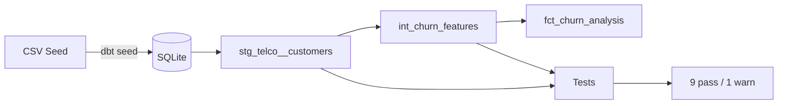

This is a repository made to learn the tech stack of a data or analytics engineer in most companies by practicing and creating a small project that will be improved over time.

# What does it do?

It is a self‑learning project to practice the modern data stack. I loaded the [Kaggle Telco Customer Churn](https://www.kaggle.com/datasets/blastchar/telco-customer-churn) dataset and transformed it into tested, documented analytics tables using Python 3.12, dbt 1.11 & dbt_utils, and SQLite3.

The whole environment was developed in GitHub Codespaces, but runs fine locally too

---

## Architecture



For this project, I have used the standard dbt modeling layers:

* **Staging** — Rename, cast, clean. 1:1 with source.
* **Intermediate** — Basic business logic, churn flagging, customer segmentation.
* **Marts** — Aggregated tables ready for analysis or dashboards.

## Tech stack

| **Area**        | **Tool**                                    |
|:---------------:|:-------------------------------------------:|
| Transformations | dbt Core, dbt_utils                         |
| Database        | SQLite (file-based, portable)               |
| Orchestration   | Python script (ready for Airflow migration) |
| Environment     | GitHub Codespaces (cloud IDE, zero config)  |
| Version control | Git & GitHub                                |

## Usage

```bash
git clone https://github.com/Javiersdr/Churn-pipeline
pip install -r requirements.txt
cd Churn-pipeline/dbt_churn
dbt deps
cd ..
python run_pipeline.py
```
> *Thanks to SQLite, the entire database lives in a single file. No server setup needed.*

## Testing strategy

* **Generic tests**: ```unique, not_null, accepted_values, accepted_range```
* **Singular tests**:
    * ```check_phone_logic``` — No phone service cannot have multiple lines
    * ```check_charges```— Here, the idea is: $$ \text{error} = \left| total\_charges - (tenure \times monthly\_charges) \right| \leq 100 $$. If the test fails on 25 rows or less, it shows a warning. If the number is higher, fail.

## Future improvements

### Airflow orchestration

Airflow is also widely used on the industry, so the python script will be replaced with a full DAG.

### Docker

Containerization of the entire stack.

### Cloud data warehouse

Migration from SQLite to Snowflake/BigQuery to allow scalability.

### CI/CD

GitHub Actions to run ```dbt run``` and ```dbt test``` on every pull request.

### Advanced tests

For complex data validation requirements and enhanced data quality.